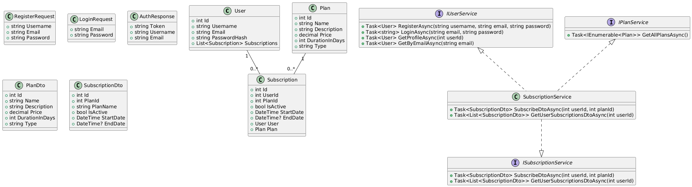

# Phoenix Subscription Service

A simple backend service for managing subscriptions, allowing users to view plans, subscribe, and manage their subscriptions.

---

## Diagrams

### Class Diagram

### Use Case Diagram

---

## Overview

This project demonstrates a clean architecture approach for a subscription management system.  
It includes:

- User registration and login
- Viewing available subscription plans
- Subscribing to a plan
- Retrieving user subscriptions

---

## Technology Choices

- **C# .NET 7 / ASP.NET Core** – For a modern, fast, and maintainable backend.
- **Clean Architecture** – Separates concerns between domain, application, and infrastructure layers.
- **In-memory or simple repository pattern** – Easy to extend for a database like SQL Server or PostgreSQL.
- **Swagger / OpenAPI** – For API documentation and testing.

---

## Scaling Considerations

If this project were to grow in scale:

1. Introduce a relational database (SQL Server / PostgreSQL) or NoSQL (MongoDB) for persistence.
2. Add proper authentication and authorization using JWT with role-based access.
3. Use caching (Redis) for frequently requested data like plans.
4. Implement CQRS for handling complex read/write operations.
5. Add background jobs or message queues for subscription expiry notifications.

---

## Time Spent

Approximately **2-3 hours** to implement the core functionality and prepare the diagrams.

---

## AI Assistance

AI was used to:

- Generate example DTOs and service interfaces
- Draft controller structures and method signatures
- Suggest architecture and design patterns

---

## API Endpoints

### Auth
- `POST /api/auth/register`
- `POST /api/auth/login`

### Users
- `GET /api/users/profile?userId={id}`

### Plans
- `GET /api/plans`

### Subscriptions
- `POST /api/subscriptions/subscribe?userId={id}&planId={id}`
- `GET /api/subscriptions?userId={id}`

---

## Folder Structure

